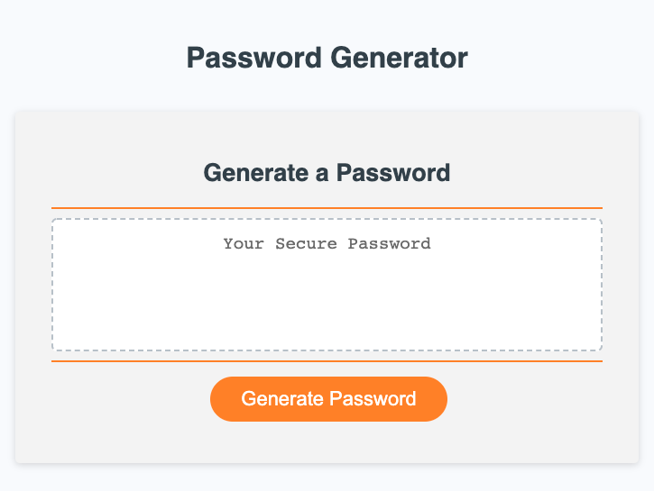

### Live site at [Password Generator](https://cgsdesign.github.io/passwordGen/.)
​
For this project I worked primarily in Javasript to create a functional password generator. The given generator allows for various input types: uppercase letters, lowercase letters, numbers, and symbols. It also allows for password length between 8 and 128 characters. It relies on clear prompts to gain user input criteria.
​
## Key Features
* Clean CSS matching brand orange
* Multiple variable prompt inputs linked to generate single output
* Lowercase letters, uppercase letters, numbers, and symbols available to chose from 
* Wide range of password lengths available: 8-128 characters
* Inclusion of multiple levels of shuffling to better ensure password security

## Credits
​
* Base code curtasy of uwisconsin_coding_bootcamp
* Fisher-Yates code curtasy of https://www.tutorialspoint.com/what-is-fisher-yates-shuffle-in-javascript
​
## Licence 

@@ -41,4 +41,3 @@ THE SOFTWARE IS PROVIDED "AS IS", WITHOUT WARRANTY OF ANY KIND, EXPRESS OR IMPLI
FITNESS FOR A PARTICULAR PURPOSE AND NONINFRINGEMENT. IN NO EVENT SHALL THE
AUTHORS OR COPYRIGHT HOLDERS BE LIABLE FOR ANY CLAIM, DAMAGES OR OTHER
LIABILITY, WHETHER IN AN ACTION OF CONTRACT, TORT OR OTHERWISE, ARISING FROM, OUT OF OR IN CONNECTION WITH THE SOFTWARE OR THE USE OR OTHER DEALINGS IN THE SOFTWARE.
